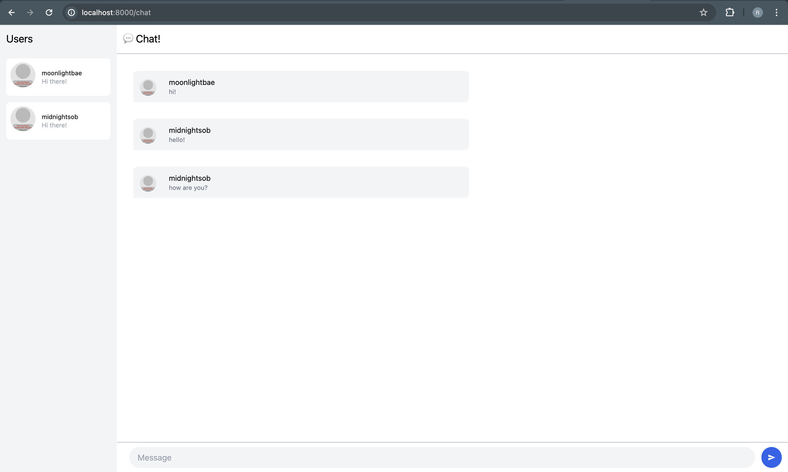
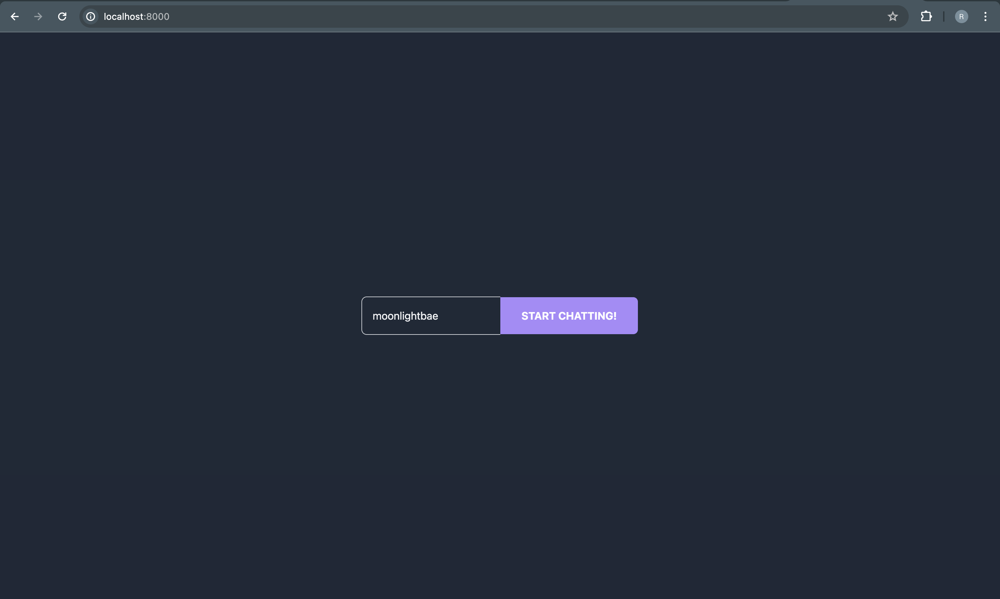
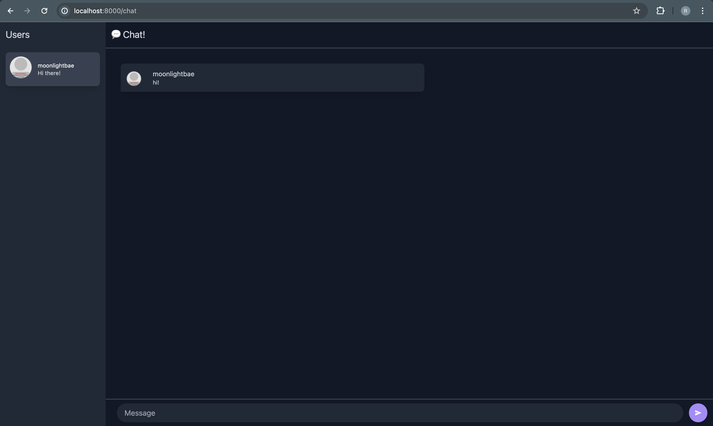

# Tutorial 10 - YewChat 💬
**Rachel Heningtyas Zanetta Erari - 2206081944 - A**

## 3.1 Original Code

After cloning the two repositories from https://github.com/jtordgeman/YewChat/tree/websockets-part2 and https://github.com/jtordgeman/SimpleWebsocketServer, and upon running `npm start` YewChat and the Simple WebSocket Server, we can interact between pages that have entered a username into the application. 

## 3.2. Add Some Creativities to The Webclient

I modified the theme to follow a dark-mode color palette and added violet accents.

